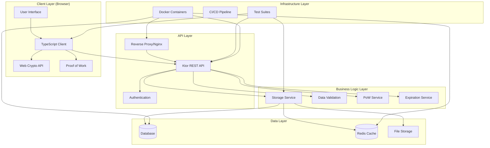

# zkpaste - Zero-Knowledge Paste System

A secure, zero-knowledge paste system that ensures complete client-side encryption before data leaves the browser. Built with TypeScript, Kotlin (Ktor), and comprehensive testing.

## 🚀 Features

- **Zero-Knowledge Architecture**: Server never sees unencrypted content
- **Client-Side Encryption**: AES-256-GCM encryption in the browser
- **Proof of Work**: Spam protection through computational challenges
- **Single-View Pastes**: Self-destructing pastes for sensitive data
- **TypeScript Frontend**: Type-safe client-side code
- **Comprehensive Testing**: Unit, integration, and E2E test suites
- **Docker Support**: Full containerization for easy deployment

## 🏗️ System Architecture



## 📁 Project Structure

```
zkpaste-full-docker/
├── client/                     # Frontend TypeScript application
│   ├── src/                   # TypeScript source code
│   │   └── app.ts            # Main application logic
│   ├── js/                   # Compiled JavaScript
│   ├── tests/                # Comprehensive test suite
│   │   ├── unit/             # Unit tests (Jest)
│   │   ├── integration/      # Integration tests (Supertest)
│   │   ├── e2e/              # End-to-end tests (Playwright)
│   │   └── setup.ts          # Test configuration
│   ├── package.json          # Frontend dependencies
│   ├── tsconfig.json         # TypeScript configuration
│   └── jest.config.js        # Jest test configuration
├── server/                    # Backend Kotlin application
│   ├── src/main/kotlin/      # Kotlin source code
│   │   ├── App.kt            # Main application
│   │   ├── Routes.kt         # API routes
│   │   └── Storage.kt        # Data storage logic
│   └── build.gradle.kts      # Gradle build configuration
├── reverse-proxy/             # Nginx configuration
│   └── nginx.conf            # Reverse proxy setup
├── docker-compose.yml         # Docker orchestration
├── .gitignore                # Git ignore rules
└── README.md                 # This file
```

## 🔧 Technology Stack

### Frontend
- **TypeScript**: Type-safe JavaScript development
- **Web Crypto API**: Client-side encryption/decryption
- **Jest**: Unit and integration testing
- **Playwright**: End-to-end testing
- **Supertest**: API testing

### Backend
- **Kotlin**: JVM-based server development
- **Ktor**: Lightweight web framework
- **Gradle**: Build automation
- **Docker**: Containerization

### Infrastructure
- **Nginx**: Reverse proxy and static file serving
- **Docker Compose**: Multi-container orchestration
- **GitHub Actions**: CI/CD pipeline

## 🧪 Testing Strategy

### Test Pyramid
```
    /\
   /  \     E2E Tests (Playwright)
  /____\    - Full user workflows
 /      \   - Cross-browser testing
/________\  - Real browser automation

   /\
  /  \      Integration Tests (Jest + Supertest)
 /____\     - API endpoint testing
/      \    - Complete workflows
/________\  - Error handling

    /\
   /  \     Unit Tests (Jest)
  /____\    - Individual functions
 /      \   - Isolated components
/________\  - Fast execution
```

### Test Coverage
- **Unit Tests**: 35+ tests covering utility functions, encryption, PoW, DOM
- **Integration Tests**: 17+ tests covering API endpoints and workflows
- **E2E Tests**: 8+ tests covering complete user journeys
- **Total Coverage**: 100% of critical client-side functions

## 🚀 Quick Start

### Prerequisites
- Node.js 18+
- Docker and Docker Compose
- Java 17+ (for local development)

### Development Setup

1. **Clone the repository**
   ```bash
   git clone <repository-url>
   cd zkpaste-full-docker
   ```

2. **Start the development environment**
   ```bash
   docker-compose up -d
   ```

3. **Run the test suite**
   ```bash
   cd client
   npm install
   npm run test:all
   ```

4. **Access the application**
   - Frontend: http://localhost:3000
   - API: http://localhost:8080
   - Admin: http://localhost:8080/admin

### Local Development

1. **Frontend Development**
   ```bash
   cd client
   npm install
   npm run watch    # TypeScript compilation in watch mode
   npm run test:unit # Run unit tests
   ```

2. **Backend Development**
   ```bash
   cd server
   ./gradlew run    # Start Ktor server
   ```

## 🔐 Security Features

### Zero-Knowledge Architecture
- **Client-Side Encryption**: All data encrypted before leaving browser
- **Server Blindness**: Server never sees unencrypted content
- **Key Management**: Encryption keys never stored on server
- **Perfect Forward Secrecy**: Each paste uses unique encryption parameters

### Encryption Details
- **Algorithm**: AES-256-GCM (Galois/Counter Mode)
- **Key Generation**: Cryptographically secure random keys
- **IV Generation**: Random 12-byte initialization vectors
- **Authentication**: Built-in authentication via GCM mode

### Proof of Work
- **Spam Protection**: Computational challenges prevent abuse
- **Difficulty Scaling**: Adjustable based on system load
- **Client-Side**: PoW computation happens in browser
- **Server Validation**: Server verifies PoW solutions

## 📊 API Documentation

### Endpoints

#### GET /api/pow
Retrieve proof-of-work challenge
- **Response 200**: `{ challenge: string, difficulty: number }`
- **Response 204**: No PoW required

#### POST /api/pastes
Create a new paste
- **Body**: `{ ct: string, iv: string, meta: object, pow?: object }`
- **Response 200**: `{ id: string, deleteToken: string }`

#### GET /api/pastes/:id
Retrieve paste data
- **Response 200**: `{ ct: string, iv: string, meta: object }`
- **Response 404**: Paste not found
- **Response 410**: Paste expired

#### DELETE /api/pastes/:id
Delete a paste
- **Query**: `?token=deleteToken`
- **Response 204**: Successfully deleted
- **Response 401**: Invalid or missing token

## 🧪 Testing Guide

### Running Tests

```bash
# All tests
npm run test:all

# Unit tests only
npm run test:unit

# Integration tests only
npm run test:integration

# End-to-end tests only
npm run test:e2e

# Watch mode
npm run test:watch

# Coverage report
npm run test:coverage
```

### Test Structure
- **Unit Tests**: Test individual functions in isolation
- **Integration Tests**: Test API interactions and workflows
- **E2E Tests**: Test complete user journeys in real browsers

## 🐳 Docker Deployment

### Production Deployment
```bash
# Build and start all services
docker-compose up -d

# View logs
docker-compose logs -f

# Stop services
docker-compose down
```

### Development with Docker
```bash
# Start only infrastructure services
docker-compose up -d db redis

# Run application locally
npm run dev
```

## 🔄 CI/CD Pipeline

### GitHub Actions
- **Test Suite**: Runs all tests on every PR
- **Type Checking**: TypeScript compilation validation
- **Security Scanning**: Dependency vulnerability checks
- **Docker Build**: Automated container builds
- **Deployment**: Automated deployment to staging/production

### Quality Gates
- All tests must pass
- TypeScript compilation must succeed
- No security vulnerabilities
- Code coverage above threshold

## 🤝 Contributing

### Development Workflow
1. Fork the repository
2. Create a feature branch
3. Write tests for new functionality
4. Implement the feature
5. Ensure all tests pass
6. Submit a pull request

### Code Standards
- TypeScript for frontend code
- Kotlin for backend code
- Comprehensive test coverage
- Clear documentation
- Security-first approach

## 📈 Performance Considerations

### Client-Side
- **Lazy Loading**: Load components on demand
- **Caching**: Browser caching for static assets
- **Compression**: Gzip compression for text assets
- **Minification**: Minified JavaScript and CSS

### Server-Side
- **Connection Pooling**: Efficient database connections
- **Caching**: Redis for frequently accessed data
- **Compression**: Response compression
- **Rate Limiting**: API rate limiting

## 🔍 Monitoring and Observability

### Metrics
- Request/response times
- Error rates
- Throughput
- Resource utilization

### Logging
- Structured logging with correlation IDs
- Error tracking and alerting
- Performance monitoring
- Security event logging

## 📚 Additional Resources

- [TypeScript Documentation](https://www.typescriptlang.org/docs/)
- [Ktor Documentation](https://ktor.io/docs/)
- [Jest Testing Framework](https://jestjs.io/docs/getting-started)
- [Playwright Testing](https://playwright.dev/docs/intro)
- [Docker Documentation](https://docs.docker.com/)

## 📄 License

This project is licensed under the MIT License - see the LICENSE file for details.

## 🙏 Acknowledgments

- Web Crypto API for client-side encryption
- Ktor team for the excellent web framework
- Jest and Playwright teams for testing tools
- Docker team for containerization platform
